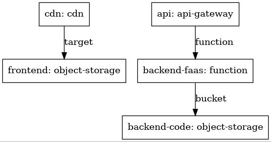

Serverless Webapp Multiform Example
===

This folder contains an [example architecture](architecture.yaml) together with [templates](templates/) required for this architecture. This architecture describes the required infrastructure for a [serverless](https://www.cloudflare.com/learning/serverless/what-is-serverless/) web application. Deployments for each platform (that the templates in this repo are based on), as well as the files for the FaaS code and website, can be found in this [repository](https://github.com/michidk/serverless-webapp/).

## Contents

The relevant parts of this example are:

| Folder/File | Description |
| ---- | ----------- |
| [templates/](templates/) | The template definitions for the webapp |
| [architecture.yaml](architecture.yaml) | The architecture definition file |
| [openapi.yaml](openapi.yaml) | The OpenAPI definition required by AWS and Azure |
| [swagger.yaml](swagger.yaml) | The OpenAPI definition file required by GCP |
